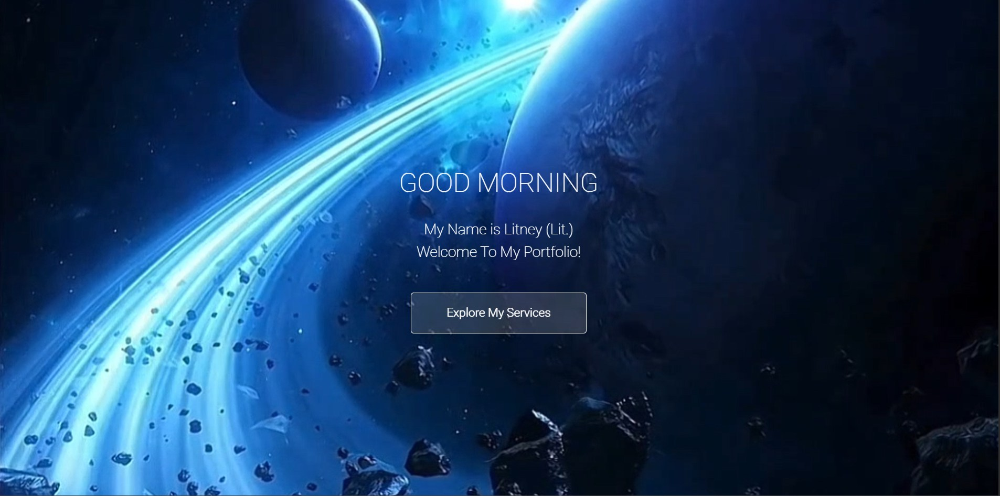

# Personal Portfolio Website

This project is my personal portfolio website, designed to showcase my skills, projects, and services as a software engineer. Built using HTML, CSS, and JavaScript, the site serves as a digital business card and a platform to connect with potential clients and collaborators.

## Table of contents

- [Overview](#overview)
  - [Screenshot](#screenshot)
  - [Links](#links)
- [My process](#my-process)
  - [Built with](#built-with)
  - [What I learned](#what-i-learned)
- [Author](#author)

## Overview
Litney Pollard-Hinton's portfolio website is a clean, responsive, and accessible platform designed to highlight my professional journey, technical skills, and personal projects.

Key features include:

- Home: An introduction and overview of my services.

- About Me: A brief background and my journey into software engineering.

- My Work: Showcases of projects like Golden Hour Café, Salon Luxe, and Ronnie's Q.

- Contact: A form to reach out for inquiries or collaborations.

### Screenshot

### Links

- Live Site URL: [Portfolio](https://lit-97.github.io/portfolio/)

## My process
I began by selecting a clean and modern template from HTML5 UP. Then I:

1. Customized the template to reflect my personal brand and style.

2. Integrated sections to showcase my skills, projects, and services.

3. Ensured the website is fully responsive and accessible across devices.

4. Added interactive elements using JavaScript to enhance user experience.

5. Deployed the site using GitHub Pages for easy access and sharing.

### Built with

- HTML5

- CSS3

- JavaScript

- GitHub Pages (Hosting)

### Growth & Insights 🌱

- Customizing and deploying a static website using GitHub Pages.

- Implementing responsive design principles for mobile-friendly layouts.

- Enhancing user experience with interactive JavaScript elements.

- Showcasing personal projects and services effectively.

## Author

- Website - [My Portfolio](https://lit-97.github.io/portfolio/)
- GitHub  - [@Lit-97](https://github.com/Lit-97)
